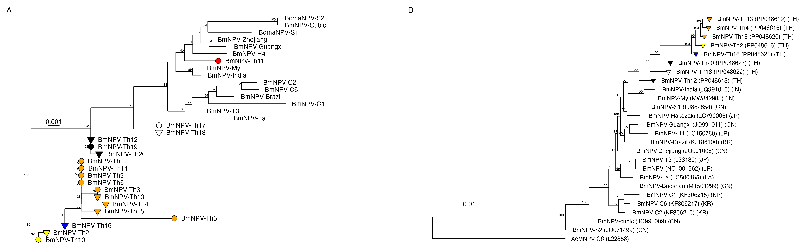
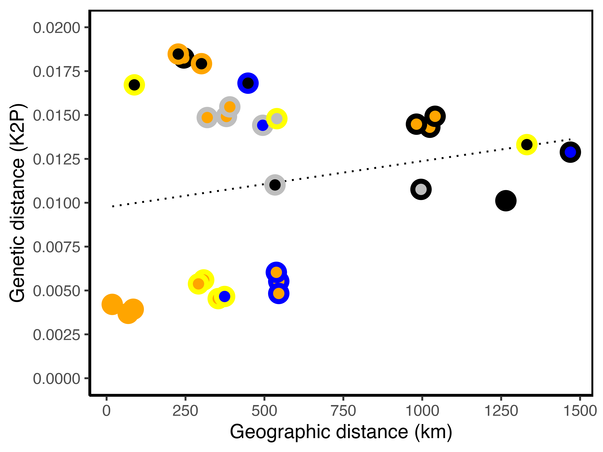

# Analysis of the geographical and genetic distance of samples of the Bombyx mori nucleopolyhedrovirus from Thailand

The figures and content in this repository are derived from the following publication:

-   **Wennmann, J.T., Senger, S., Ruoff, B., Jehle, J.A., Suraporn, S. (accepted for publication).** Distribution and genetic deviersity of Bombyx mori nucleopolyhedrovirus in mass-reared silkworms in Thailand. *Journal of Invertebrate Pathology*, <https://doi.org/10.1016/j.jip.2024.108221>.

## Aim of this repository

-   Demonstration of the R code for creating a map of Thailand to mark sampling sites of baculovirus samples.

-   Learn how R can be used to analyse the correlation between geographical and genetic distance.

## Map of Thailand

As part of the study, 21 locations in Thailand were sampled to collect BmNPV (Wennmann et al., 2024). For a better visualization, a map showing all the provinces of Thailand was created. The provinces were dividgied into four regions. The regions were coloured according to the intensity of agricultural cultivation of mulberry trees. The locations of the BmNPV samples were marked with different symbols, depending on whether they were analysed using whole genome sequencing (WGS) or only partial gene sequencing (Sanger sequencing). Phylogenetic analyses were performed based on the sequence data, and depending on the phylogenetic clade, the symbols on the map were coloured accordingly. This complex representation conveys a lot of interesting information ([Figure](https://github.com/wennj/bmnpv-map-thailand/blob/main/output/mulbarry%20plantation%20thailand%20with%20signs.png)).

[Click here for the R code used to create the figure.](https://github.com/wennj/bmnpv-map-thailand/blob/main/Thailand%20BmNPV%20map.Rmd)

Click to expand the full-sized map

## BmNPV Phylogeny

Two phylogenies were constructed based on partially sequenced genes and the sequence of 138 open reading frames. The phylogenies should also be linked to the map and thus to the location where the BmNPV samples were collected. The phylogeny itself was carried out using MEGA and the trees were read into R. Details of the sequence and phylogenetic analysis can be found in the publication (Wennmann et al., 2024).

[Click here for the R code used to create the figure.](https://github.com/wennj/bmnpv-map-thailand/blob/main/Phylogeny%20BmNPV%20Thailand.Rmd)

## Correlation between geographic and genetic distance

The geographical information (longitude/latitude) can be used to calculate the distances between the BmNPV collection sites. Genetic distances, in this study the Kimura 2 parameter, can be calculated from the sequence data. A correlation can be used to determine whether there is a correlation between these two.

[Click here for the R code used to create the next two figures.](https://github.com/wennj/bmnpv-map-thailand/blob/main/Genetic%20geogr%20distance%20correlation%20analysis.Rmd)

The correlation can also be checked for all CDS individually. The alignments of the individual CDS serve as a basis for this. Output is only generated for the CDS that show a positive correlation.

Click to expand the full-sized map

## Analysis of the genetic distance at the CDS level

The alignments of all 138 CDSs of the fully sequenced genomes also allowed the genetic K2P distance to be considered at the level of individual CDSs. This was done by calculating the K2P distance for each CDS and displaying the result in a matrix. It was also possible to check whether there was a correlation between geographical and genetic distance.

[Click here for the R code used to create the figure.](https://github.com/wennj/bmnpv-map-thailand/blob/main/CDS%20k2p%20distance%20analysis.Rmd)

Click to expand the full-sized map

